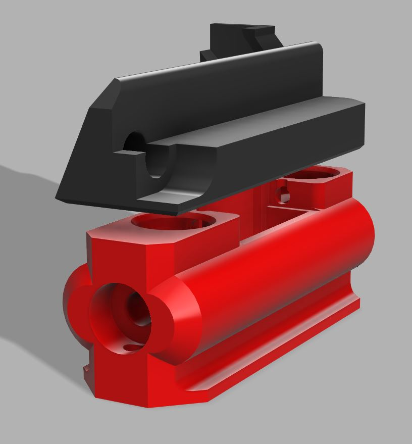

# Front Cowling Mount
Thanks to Jlas1 for making this.

This is an adapter that allows using SlideSwipe on cowlings meant for klicky like the regular klicky cowling or the one for the LGX Lite.



## Pros and cons compared to integrated mount
| Pro | Con |
| ---- | ---- |
| + Allows keeping the same Cowling (if you allready use one of the compatible ones) | - Probe is further away from the nozzle (can probe less of the bed) |
| + Allows switching between Klicky and Slideswipe | - Uses a slightly different probe that is not compatible with the other mounting options |

## BOM (Differences only)
### Screws
- 1x M3x6 BHSC screw

## Build
The build process is the same as normal, just substitute the cowling with the "Slideswipe_KlickyAdapter_mount" and the probe with "Slideswipe_KlickyAdapter_probe"

## Klipper Setup
The klipper setup is also almost the same, however we need a few changes, **do not try probing before this step**

## Pickup position
Move the X of the pickup position 8mm to the left, to do this change this part of the "SS_PICKUP_POS" macro from:
```
[gcode_macro SS_PICKUP_POS]
variable_x: 115
...
```
to:
```
[gcode_macro SS_PICKUP_POS]
variable_x: 107
...
```

## Probe offset
Increase the X-offset of the probe by 8mm (to 28mm):
```
[probe]
pin: ^PC14
x_offset: 28
...
```

## Change Mesh Leveling coordinates
Replace the whole "[bed_mesh]" section with this:
```
[bed_mesh]
speed: 200
horizontal_move_z: 25
mesh_min: 32,32
mesh_max: 88, 88
probe_count: 3,3
algorithm: bicubic
```