# UnklickySlideswipe (If you have a better idea for a name, let me know)
## Introduction
This is a bit of a mixture of [unklicky](https://github.com/majarspeed/Unklicky/tree/main/Unklicky) and [mechabl](https://www.thingiverse.com/thing:4736440) in a SlideswipeProbe formfactor. There is also a euclid compatible derivative of this called [Unclid](https://github.com/Minsekt/unclid)(I love that name).

### Principle
Basically, the magnet in the plunger bridges the screws on both sides.
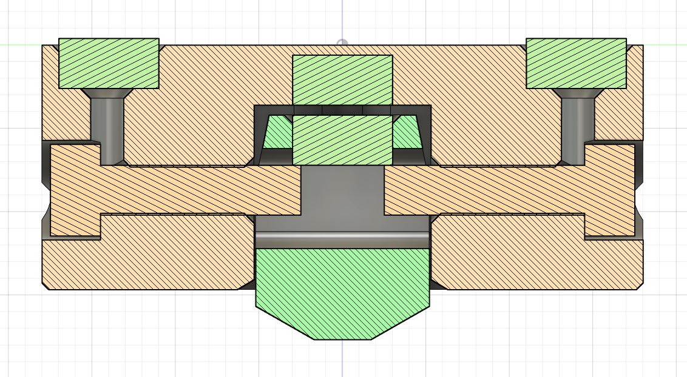

## Pros and cons compared to microswitch version
| Pro | Con |
| ---- | ---- |
| + Much better repeatability | - More sensitive to print quality and assembly |
| + More tolerant to abuse | - Can get stuck open, which is still safe but annoying (this is usually caused by assembly or print errors and amplified by weaker magnets) |
| + Fully symetric |  |
| + Can be made from stuff you probably allready have  |  |
| + Actuation force can be tuned by using stronger or weaker magnets or increasing the distance between them  |  |
| + Larger plunger tip for better repeatability on textured surfaces  |  |

## BOM
- 2x M3x12 Socket Head Screws (Preferably stainless but slightly magnetic)
- 4x 6x3 Round magnets
- 5cm of stranded wire

### Tools
- Some epoxy or superglue (glue is optional)
- A multimeter

## Printing
Ironing for the top and using a smooth print surface is recommended for the plunger.

The loose probe should ideally need no post processing while the tight one need some sanding on the plunger but should perform slightly better.

## Post processing
Remove the integrated support from the plunger.

Make sure there are no blobs on or in the plunger or inside the hole in the probe.

If you printed the tight probe, sand the sides of the plunger until it slides in and out with little resistance.

## Build
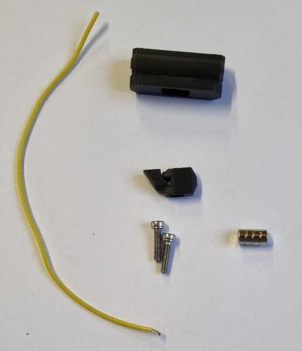
### Magnet spring
Push the probe magnet in the hole (I use the pointy side of the plunger for that, but there are lots of way to do it). The magnet should preferably have the opposite polarity to the docking magnets though same works too.

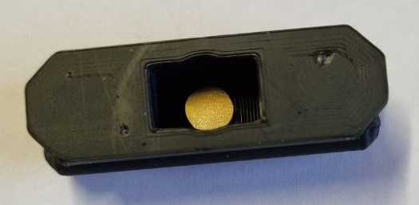
### Plunger
Press the magnet into the plunger, so it sticks to the top of the probe like shown below.
Make sure the probe still moves in and out of the body easily (though with the resistance of the magnet spring).

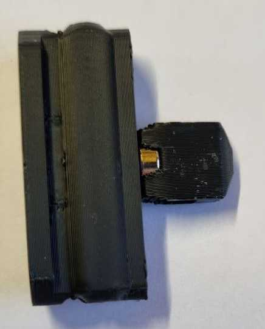
### Screws
Strip a couple of cm of the stranded wire.

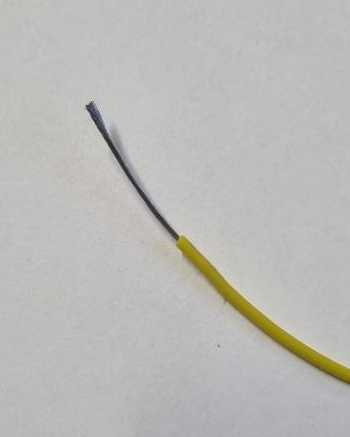

Insert the wire into the top of the magnet hole and push it in to the screw hole a little bit.

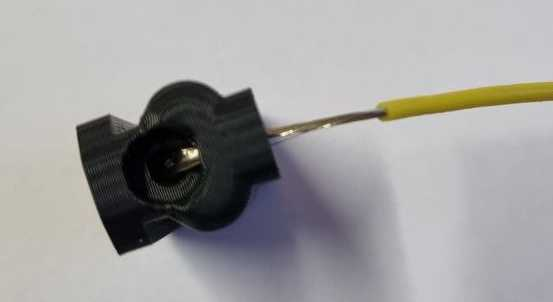

Screw the screw into the hole (not all the way jet so we can insert the plunger later)

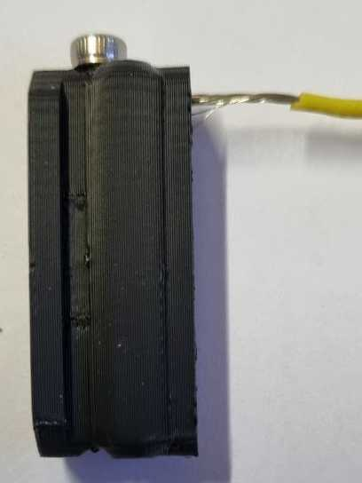

Trim the wire so, it stands out about 1 or 2mm from the hole.

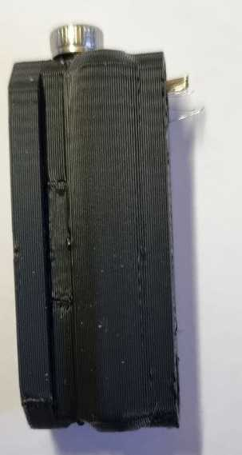

Repeat for the other side.
### Dock Magnets
Spread out the wire strands in the magnet holes.

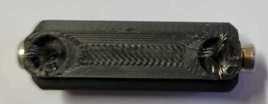

Press the magnets into the holes in the right polarity to fit the mount. A vise can help a lot here, but you can also just push it against a flat surface.

Trim of the excess wires if they get in the way and measure continuity between the magnets and the screws.

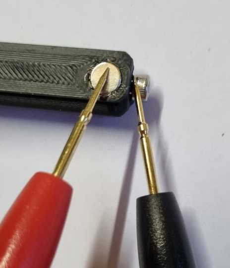

### Lubricate (Optional)
If you have some non-sticky, non-conductive and non-drippy lubricant (like dry PTFE spray) drown the probe and the plunger in it and let it dry.

### Plunger install
Put the plunger into the hole, press it all the way down and screw both screws in all the way. measure continuity between both magnets, without anything touching the plunger it should be connected but break when pushing the plunger in.

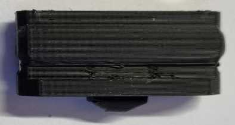

## Klipper setup
All you need to do is recalibrate your z-offset.
I do reccomend working in the probe a bit by running a couple hundred probes through it first (PROBE_ACCURACY SAMPLES=100) as it needs a bit of a work in period before it starts working really well.

## Feedback
Let me know how it worked out for you, you can find me on the voron discord.